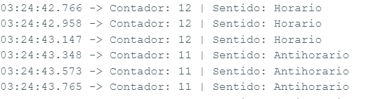

# *Lectura-de-encoder*
## Descrpción del código
Este programa en Arduino permite leer y determinar el sentido de giro de un encoder rotatorio utilizando interrupciones externas.

## Objetivo
Permitir al usuario medir el movimiento rotacional (posición incremental y dirección) de un encoder mediante Arduino, ideal para proyectos de control de motores, robótica o medición de ángulos.

## Funcionamiento
•	Pines utilizados:

- `pinA`: Pin digital 2.
- `pinB`: Pin digital 3.

• El programa detecta los pulsos generados por el canal A del encoder mediante una interrupción `attachInterrupt()`, y lee el canal B para determinar la dirección de giro:

- Si el canal B está en HIGH cuando ocurre el pulso → el giro es horario.

- Si el canal B está en LOW → el giro es antihorario.

• Se mantiene un contador `contador` que aumenta o disminuye según la dirección de rotación.

## Resultados

Al ejecutar el programa y girar el encoder:

• El monitor serial muestra en tiempo real el valor del contador y el sentido de giro.

• Cada paso del encoder incrementa o decrementa el contador según la dirección:

-Horario ➜ el contador aumenta.

-Antihorario ➜ el contador disminuye.

## Conclusión

Este proyecto demuestra cómo leer y procesar las señales de un encoder rotatorio utilizando interrupciones externas en Arduino, logrando una detección precisa del sentido de giro y el número de pasos.

Gracias a su simplicidad y eficiencia, este código puede servir como base para:

- Control de motores con realimentación (control de posición o velocidad).

- Medición angular o de desplazamiento.

- Interfaces rotatorias (como perillas o selectores digitales).

En conclusión, se validó correctamente el funcionamiento del encoder, mostrando una lectura confiable, direccional y en tiempo real.

